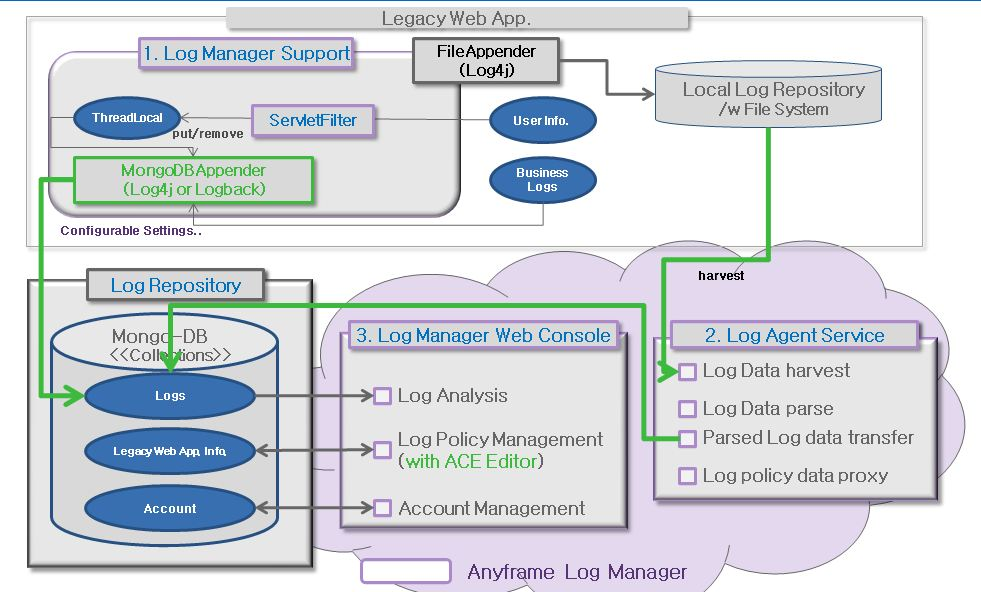
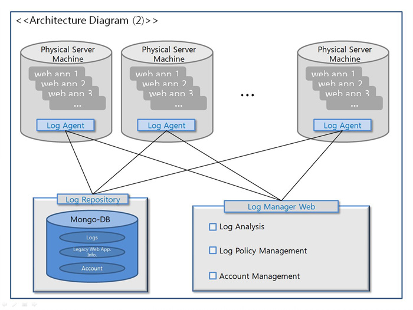

Anyframe Log Manager
====
Anyframe Log Manager는 개발 및 유지보수 단계에서 로컬 개발 환경이 아닌 서버 개발환경(개발/스테이징/운영)의 로그 데이타에 대한 접근성을 높이고, 분석을 위한 필터 및 편의기능 제공을 위한 웹 기반의 도구로써 로그 조회 기능을 제공한다. 또한, 원격에서 Legacy Application의 로그 정책을 관리하며 최근에 이슈가 되고 있는 경량의 NoSQL 중 하나인 MongoDB를 log repository로 활용하여 대량의 로그데이타를 수집/분석 할 수 있는 기반을 제공한다.

## 특징
* **Anyframe Java 기반의 오픈소스 로그관리 툴** : Anyframe Java를 기반으로 Web Application 형태로 개발된 오픈소스 로그 관리 도구(Tool)로서 자유롭게 확장 및 개선이 가능하다.
* **MongoDB를 활용한 대용량 로그 데이터 저장** : 기존의 RDBMS보다 가볍고 빠른 NoSQL DB인 MongoDB를 Log Repository로 채택하여 대용량의 로그데이타를 쉽고 편리하게 저장/관리 할 수 있으며, 빠르게 조회 및 검색이 가능하다
* **OSGi 기반의 Agent Service 제공** : 독립적으로 구동되는 Log Agent Service를 통해 다양한 Application 로그의 수집/관리가 가능하다.
* **다양한 종류의 Application Log Data를 관리** : Log4J, Logback 이외에 다양한 Application들의 Log Data를 수집/관리할 수 있는 기반을 제공한다.
* **정규식 기반의 로그 수집기능 제공** : 정규식 기반의 로그 수집기능을 통해 로그 데이타의 형식에 구애받지 않고 데이타를 수집할 수 있다.

## 주요기능

### Log Analysis
* 로그 조회 기능은 Grid Type View과 Text Type View의 두 가지 형태의 view를 선택하여 사용할 수 있으며, 업무화면 영역 상단의 Tab을 선택하여 각 화면을 전환할 수 있다.
* Grid Type View와 Text Type View는 기본적으로 기능이 거의 같으나, Grid Type View에는 Paging 기능과 상세 로그 조회기능이 제공되고, Text Type View에서는 log tailing 기능이 추가로 제공되는 등의 미세한 차이가 있다.
* Tab을 이용하여 두 화면의 전환 시에는 기존에 설정한 검색 조건이 동일하게 유지된다.

### Log Agent Management
* 별도의 Log Agent 를 통하여 로그 수집 및 로그 정책(log4j.xml 등) 관리를 수행하도록 제공하고 있다.
* Log Agent Service를 사용함으로서 다수의 물리적으로 분리되어 있는 시스템 환경에서도 로그 정책을 수집하거나 관리하는 것이 가능하다.
* 'Log Agent Management'는 다수의 Log Agent Service의 상태를 모니터하고 관리할 수 있는 기능을 제공하고 있으며, 주요 기능은 다음과 같다.
    * Log Agent Service의 현재 상태 모니터링/Refresh
    * Log Agent Service 재시작/변경사항 반영
    * Log Agent Service 등록정보 삭제

### Log Repository Management
* 로그 데이타가 저장될 저장소를 별도로 관리하고 저장소에 부여된 권한 정책에 따라 사용자들이 조회할 수 있도록 Log Repsoitory를 생성하고 관리하는 기능을 제공한다.

### Log Application Management
* Log Application Management 를 통해 로그 데이타를 수집할 대상 어플리케이션의 정보를 등록하고 관리하는 기능을 제공한다.
* 로그 어플리케이션의 주요 기능은 다음과 같다.
    * 로그 어플리케이션의 등록/수정/삭제
    * 로그 어플리케이션의 로그수집 정책 설정
    * 로그 어플리케이션 Status 관리(Active/Inactive/Failed)
    * 로그 어플리케이션의 로그 정책 변경

### Account Management
* Account Management에서는 로그 조회 및 로그 정책을 관리할 수 있는 사용자 계정을 생성/관리한다.
* Log Manager에서는 Account Type에 따라 로그에 대한 조회권한 및 로그 정책 및 사용자 관리 등의 기능에 대한 권한을 제한하고 있다.
    * Administrator - 해당 시스템의 운영자 또는 개발 책임자에게 부여되는 타입으로 Log Manager의 모든 기능을 사용가능
    * Developer - 일반 개발자 또는 단위 시스템 운영담당자에게 부여되는 타입으로 Log Analysis 기능만 사용가능하며, Administrator가 볼 수 있도록 허락한 Log 데이타에만 접근이 가능하다.

## 설치 환경
Anyframe Log Manager은 아래와 같은 환경에서 동작 가능하도록 개발되었다.

* JDK 1.5 이상
* Servlet Spec. 2.4 이상

이외, Anyframe Log Manager 에 대한 자세한 사용법은 [Anyframe Log Manager 매뉴얼](http://dev.anyframejava.org/docs/logmanager/1.6.0/reference/htmlsingle/logmanager.html)을 참고하도록 한다.

## 리소스
Anyframe Log Manager에서 사용하고 있는 주요 오픈소스는 다음과 같다.

* [Spring Data Mongodb](http://www.springsource.org/spring-data/mongodb)
* [Spring Data Commons](http://www.springsource.org/spring-data/commons)
* [Mongo DB](http://www.mongodb.org/)
* [jQuery](http://jquery.com/)
* [ACE Editor](http://ace.ajax.org/)
 
